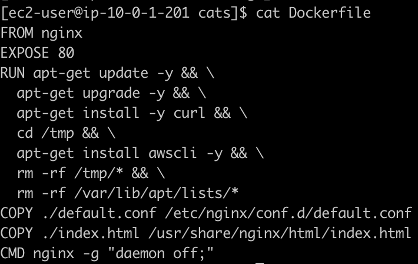

{}
You will access to *Workstation* EC2 instance and build **cats** and **dogs** docker images using Docker CLI. 
{}

1. Move to [Amazon EC2](https://console.aws.amazon.com/ec2) **Instances** and select **Workstation**. Copy its **IPv4 Public IP**. Open your terminal and SSH.  
~~~
$ ssh -i [key pair name.pem] ec2-user@[Workstation Public IP]
~~~

2. Build **cats**, **dogs** docker images with **Dockerfile**. A Dockerfile is a text document that contains all the commands a user could call on the command line to assemble an image.
~~~
$ cd catsdogs 
$ cd cats 
$ cat Dockerfile
~~~ 
Dockerfile under **cats** directory is executed when you build **cats** docker image. Use linux *cat* commands and review what is inside. 

3. Build **cats**. 
~~~
$ docker build -t cats . 
~~~

{}
Find what **FROM**, **RUN** and others mean [here.](https://docs.docker.com/engine/reference/builder/#dockerfile-reference) For instance, he **FROM** instruction initializes a new build stage and sets the Base Image for subsequent instructions.
{}

1. Move to **dogs** directory. 
~~~
$ cd ..
$ cd dogs
$ cat Dockerfile 
~~~

5. Build **dogs**.
~~~
$ docker build -t dogs .
~~~