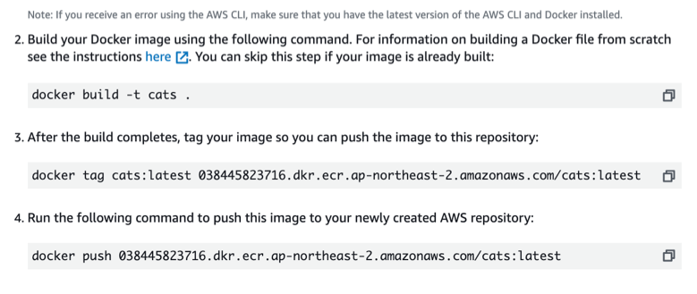

{}
이번 단계에서 실습자는 앞 단계에서 작업한 도커 이미지를 latest로 태깅한 후 **cats**, **dogs** 리포지토리로 푸시합니다.
{}

1. 이미지를 태그하고 푸시하기 위해 *Workstation*에서 ECR로 로그인합니다. 
~~~
$ sudo aws ecr get-login --no-include-email --region ap-northeast-2
~~~

~~~
$ sudo su
$(aws ecr get-login --no-include-email --region ap-northeast-2)
~~~

*Login Succeeded* 메세지가 떴는지 확인합니다.

2. cats와 dogs 이미지를 태깅한 후 각각 ECR로 푸시합니다. Amazon ECR의 Repositories에서 *View push command*를 클릭하여 빌드, 태깅, 푸시 명령어를 참조합니다. 

3. *View push command*의 세 번째, 네 번째 명령어를 복사하여 *Workstation*에서 실행합니다. 

{}
cats Repository URI, dog Repository URI는 실습자 본인의 URI여야 합니다.
{}

~~~
$ docker tag cats:latest cats Repository URI:latest 
~~~
~~~
$ docker push cats Repository URI:latest 
~~~

1. **Dogs**도 동일한 작업을 수행합니다.
~~~
$ docker tag dogs:latest dogs Repository URI:latest 
~~~
~~~
$ docker push dogs Repository URI:latest
~~~

5. **cats**와 **dogs** 리포지토리에 각각 latest 태그를 가진 도커 이미지가 잘 저장되었는지 확인합니다.

