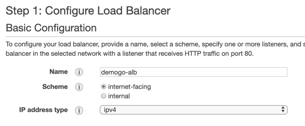
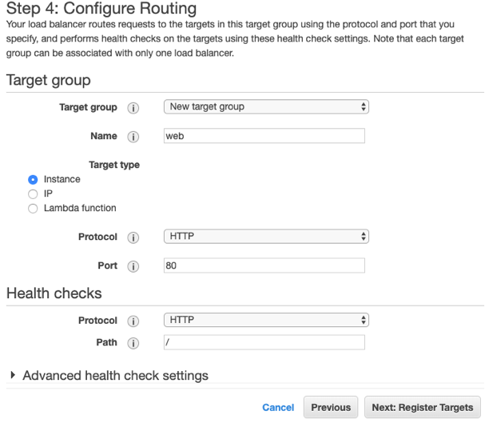

{}
Create Application Load Balancer to forward and distribute traffic to **cats and dogs** web applicaiton. Leave default setting unless specified. 
{}

## Create DEMOGO-ALB
1. Move to [EC2 Load Balancers.](https://ap-northeast-2.console.aws.amazon.com/ec2/v2/home?region=ap-northeast-2#LoadBalancers:sort=loadBalancerName)
2. Click **Create Load Balancer** and select **Application Load Balancer.** 

1. Step 1: Configure Load Balancer 
- Name: `demogo-alb` 

4. Availability zones

- VPC: DemoGoECSVPC (10.0.0.0/16)
- Select both **ap-northeast-2a** and **ap-northeast-2b.**
- Subnet: Select **PublicSubnet1, 2**
5. Click **Next: Configure Security Settings.**
6. Step 2: Configure Security Settings - **Skip** 

2. Step 3: Configure Security Groups
Select **existing security group** and uncheck **default.** Choose **ecs-demogo-ALBSG.** 

1. Step 4: Configure Routing 

- Target group: New target group
- Name: `web`
- Target type: Instance (Because **web** task definition is EC2 type.)
- Port: 80
9. Step 5: Register Targets - **Skip**  
10. Step 6: Review and create **demogo-alb**