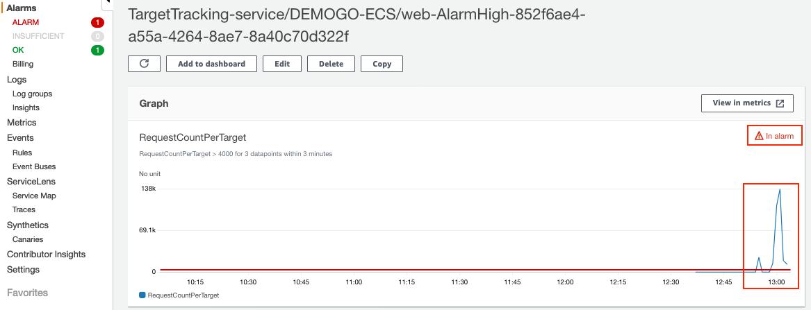
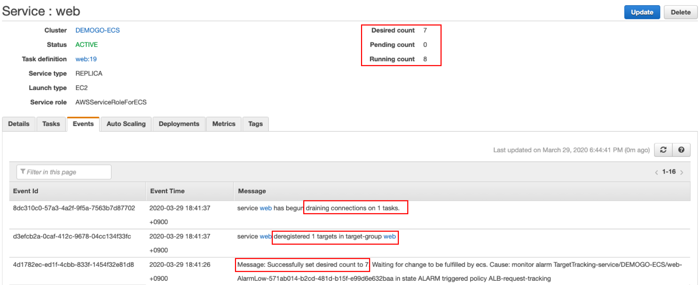

1)	Open [CloudWatch](https://console.aws.amazon.com/cloudwatch) in another web browser tab and go to **Alarms**.
2)	You may see **Insufficient data** at first. 

{}
A target tracking scaling policy does not perform scaling when the specified metric has insufficient data. It does not perform scale in because it does not interpret insufficient data as low utilization.
{}

3. Click the name of **Alarm**, the status may still be **OK.** The metric of **RequestCountPerTarget > 4000** should be above the red baseline for 3+ minutes. 

4. If you continue to run **service_loadtest_[Your Name].sh**,  CloudWatch Alarms status eventually changes into **In alarm.**  

5. Monitor **web** service status from **Events** tab. You can see what and when events occurred. 

{}
You may see gaps between the target value and the actual metric data points. This is because Service Auto Scaling always acts conservatively by rounding up or down when it determines how much capacity to add or remove. This prevents it from adding insufficient capacity or removing too much capacity.
{}

1. Go **Tasks** tab and you can see **Desired count** for **web** became 8. The **Activating** tasks is soon to be **Running.**  

7. In a while, scale-in initiated and adjust desired count. Service **web** set desired count to 7 and it will terminate one among 8 tasks running. The one also will be deregistered in ALB target group. 

