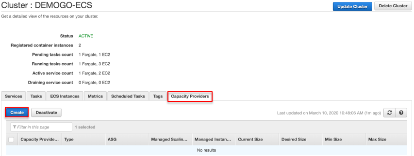
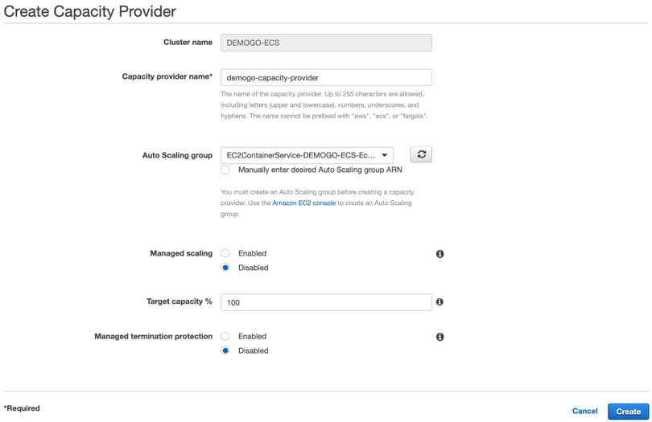

1)	[Amazon ECS](https://console.aws.amazon.com/ecs) **DEMOGO-ECS** 클러스터로 이동하여 **Capacity Providers** 탭을 선택합니다. **Create**을 클릭합니다.

2)	용량 공급자 생성하기

* Capacity provider name: `demogo-capacity-provider`
* Auto Scaling group: EC2ContainerService-[your cluster name]-EcsInstanceAsg
    * 이 ASG는 클러스터를 생성할 때 자동 생성된 것입니다.
* Managed scaling: **Disabled**을 선택합니다.
    * 실습을 위해 다음 단계에서 수동으로 구성합니다.
* Target capacity %: `100`
* Managed termination protection: **Disabled**을 선택합니다. 

{}
관리형 확장을 사용하도록 설정한 경우 1과 100 사이의 정수를 지정합니다. 목표 용량 값은 Amazon ECS 관리형 대상 추적 조정 정책에 사용되는 CloudWatch 지표의 목표 값으로 사용됩니다. 이 목표 용량 값은 최선의 노력을 기준으로 매치됩니다. 예를 들어 100의 값을 지정하면 Auto Scaling 그룹의 Amazon EC2 인스턴스가 완전히 사용되고 작업을 실행하지 않는 인스턴스는 축소되지만 이 동작은 항상 보장되지 않습니다.
{}

3)	클러스터 업데이트
Default capacity provider strategy: 드롭다운에서 **demogo-capacity-provider**를 선택합니다.
