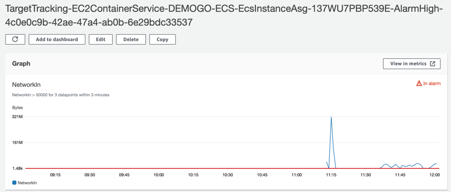
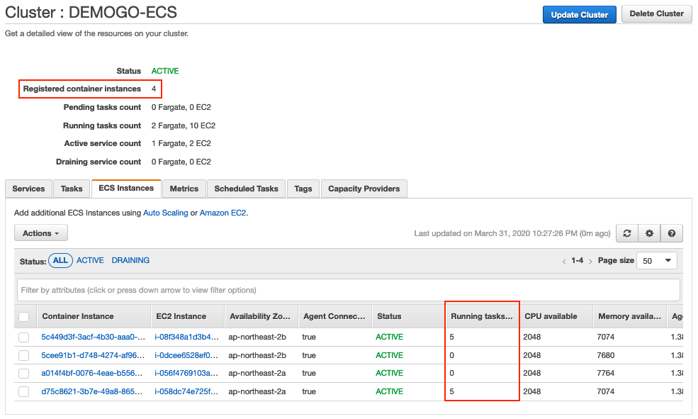
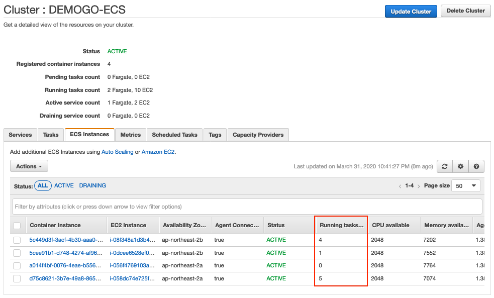
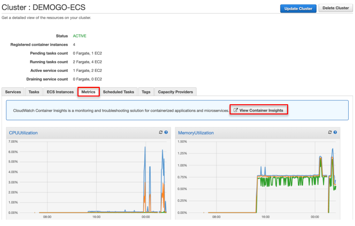
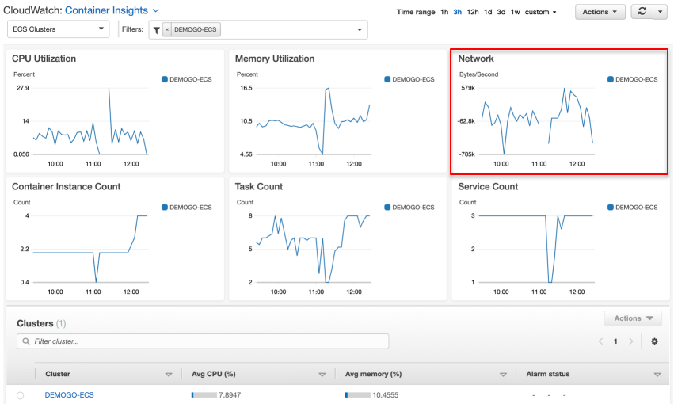

## CloudWatch Alarms
Move to [CloudWatch Alarms.](https://ap-northeast-2.console.aws.amazon.com/cloudwatch/home?region=ap-northeast-2#alarmsV2:!alarmStateFilter=ALARM)
1. Target tracking may be in **Insufficient data** state. A target tracking scaling policy does **NOT** perform scaling when the specified metric has insufficient data.

2. If the state does not change into **In alarm**, continue to run **cluster_loadtest.sh** script.
~~~
$ ./cluster_loadtest.sh 
~~~

3. Click the alarm name and you can see **Networking > 50000** above the red baseline. 

## Amazon ECS
1. Open [Amazon ECS](https://console.aws.amazon.com/ecs) in another browser tab and monitor ECS clusters. Open **ECS Instances** tab. 
2. You can see the number of ECS instances becomes 4. You can see the newly added instances do not have running tasks yet. 

1. If a new task provisioned, ECS select its instance with fewer tasks. 

## What we have learnt in 5. Monitoring
1. Select **Metrics** tab. You can find basic information and let**s find more by clicking **View Container Insights**. It will redirect you to CloudWatch Container Insight. 

2. Container Insights shows more detailed information about your ECS clusters. You can find network traffic (bytes/second) metrics too, which is ECS cluster autoscaling trigger. If you put your mouse on the graph, you can see more specific information of time and bytes. 

